

# PA4 Submission: TaskFlow Pipeline

Copy this file to <code style="color:#111827;background:#ddd6fe;padding:2px 4px;border-radius:4px;">SUBMISSION.md</code>. Put every screenshot in <code style="color:#111827;background:#ddd6fe;padding:2px 4px;border-radius:4px;">docs/</code>, embed it under the correct task, and write a short description below each image explaining what it proves. The grader should not need any file outside this repository.

## Student Information

| Field | Value |
|---|---|
| Name | Alber Abbas |
| Roll Number | 25280010 |
| GitHub Repository URL | https://github.com/alberabbas/CS487-PA4 |
| Resource Group | `rg-sp26-25280010` |
| Assigned Region | `ukwest` (used instead of `uaenorth` due to quota / capacity limits) |

## Evidence Rules

- Use relative image paths, for example: ``.
- Every image must have a 1-3 sentence description below it.
- Azure Portal screenshots must show the resource name and enough page context to identify the service.
- CLI screenshots must show the command and output.
- Mask secrets such as function keys, ACR passwords, and storage connection strings.

## Task 1: App Service Web App (15 points)

### Evidence 1.1: Forked Repository

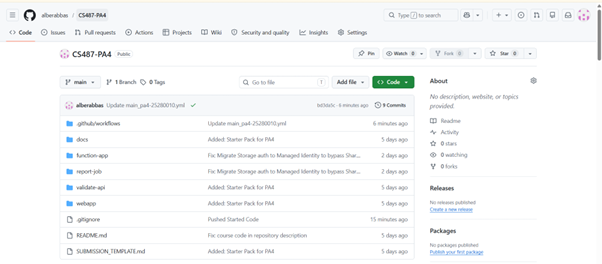

Description: This is my GitHub fork of the PA4 starter; the repo contains the `webapp/`, `function-app/`, `validate-api/`, and related folders required for TaskFlow.

### Evidence 1.2: App Service Overview

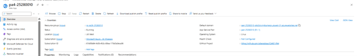

Description: The Linux Web App is **Running** in the assigned region and resource group; the overview shows the runtime stack and default hostname used for HTTPS access to the UI.

### Evidence 1.3: Deployment Center / GitHub Actions

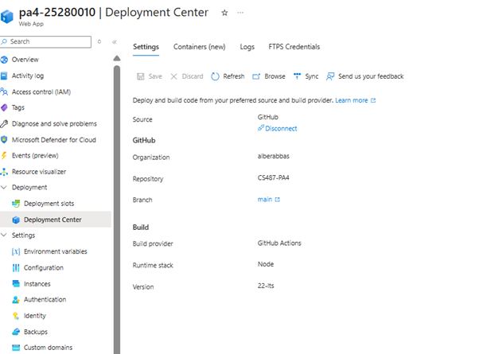

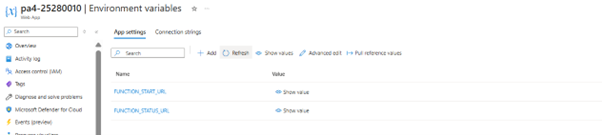

Description: The Web App is connected to my fork so pushes deploy the **`webapp/`** artifact; the second screenshot adds portal context for app **configuration** alongside deployment.

### Evidence 1.4: Live Web UI

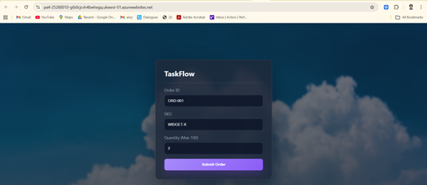

Description: The browser loads the TaskFlow page from the Web App URL, confirming the frontend is served successfully from App Service.

---

## Task 2: Azure Container Registry (15 points)

### Evidence 2.1: ACR Overview

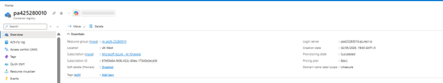

Description: ACR for this assignment shows the registry **SKU**, **resource group**, and endpoint used to push and pull `validate-api`, `report-job`, and `func-app` images.

### Evidence 2.2: Docker Builds

Successful local builds (one screenshot per image build):

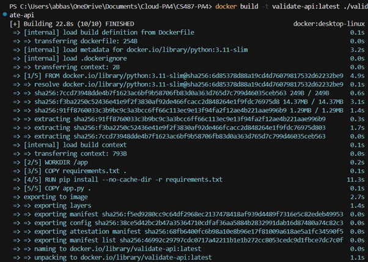

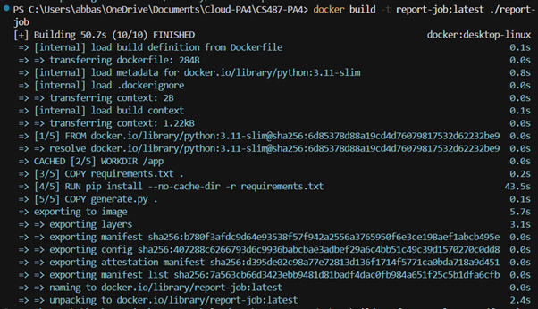

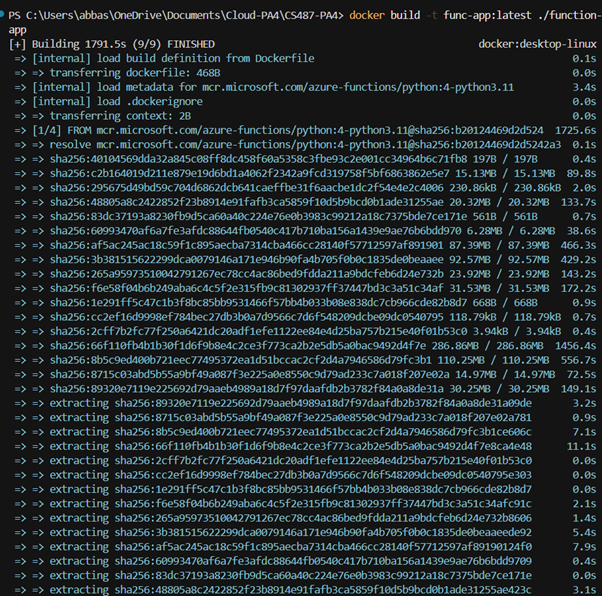

Description: Local `docker build` runs produce the three images (**`validate-api`**, **`report-job`**, **`func-app`**) from the starter’s Dockerfiles/paths; each screenshot corresponds to one successful build before tagging and **`docker push`** to ACR.

### Evidence 2.3: ACR Repositories

Repositories and tags after push (multiple views):

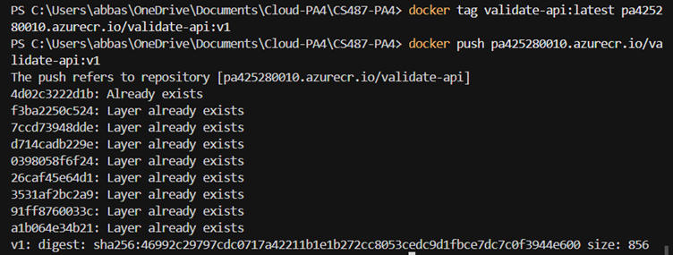

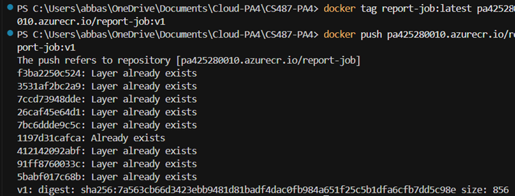

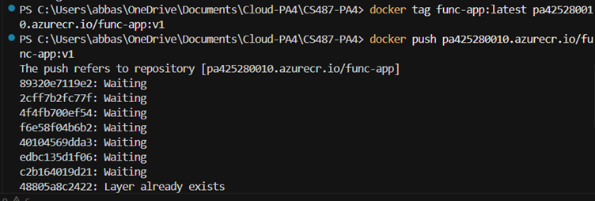

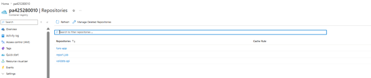

Description: The registry lists **`validate-api`**, **`report-job`**, and **`func-app`** with tags such as **`v1`**; multiple portal views plus the last capture document pushes or CLI/login detail for the same ACR.

---

## Task 3: Durable Function Implementation (12 points)

### Evidence 3.1: Completed Function Code

Implementation file: [`function-app/function_app.py`](function-app/function_app.py).

Description: The **orchestrator** calls a **validate** activity that POSTs to `VALIDATE_URL` (AKS), then a **report** activity that creates/polls/deletes the **ACI** report container and returns the Blob URL for the PDF.

### Evidence 3.2: Local Function Handler Listing

Description: The Azure Functions host lists the HTTP starter, **Durable orchestrator**, and activity functions, confirming the runtime discovered all handlers.

---

## Task 4: Function App Container Deployment (8 points)

### Evidence 4.1: Function App Container Configuration

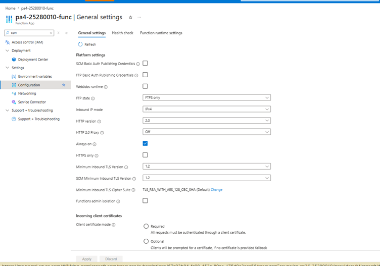

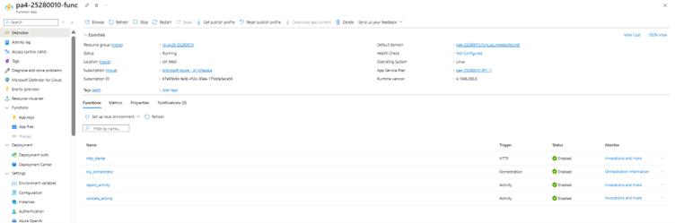

Description: Both blades show the Function App running the **`func-app:v1`** image from **ACR** (registry URI / tag visible); second image confirms the same container deployment from another scope or panel.

### Evidence 4.2: Orchestration Smoke Test

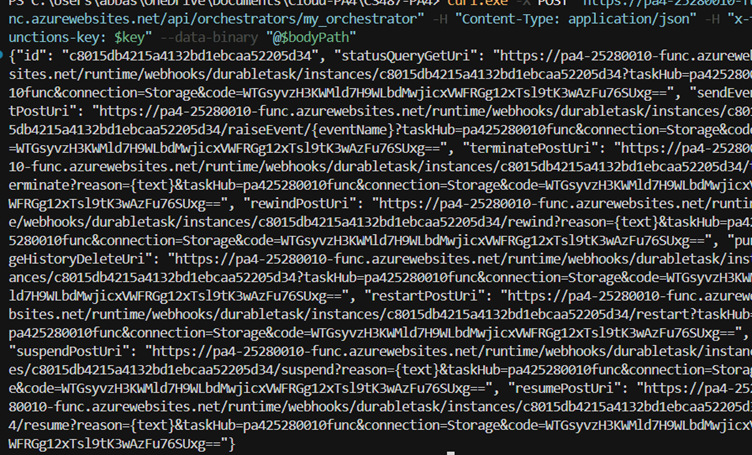

Description: **`curl`** POST to the HTTP starter returns an orchestration **`id`** and **`statusQueryGetUri`** (and related management URLs), proving the Function App accepts starts and exposes status polling for Task 4 smoke tests.

### Evidence 4.3: Expected Failed Status Before Downstream Wiring

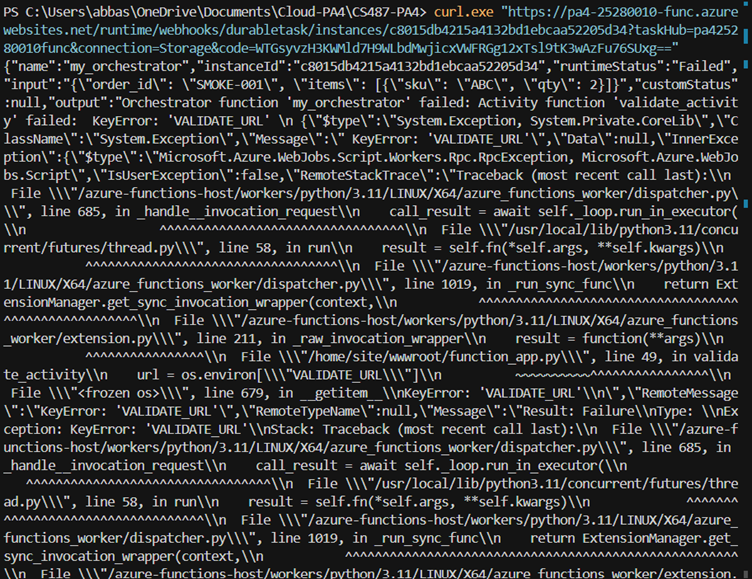

Description: Before **`VALIDATE_URL`** / downstream services were configured, the orchestration fails at the validation step as expected; this screenshot documents that intermediate state during bring-up.

---

## Task 5: AKS Validator (15 points)

### Evidence 5.1: AKS Cluster

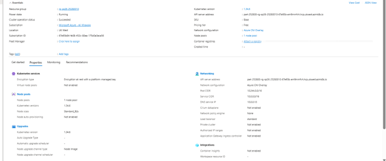

Description: The **`aks-<rollnum>`** cluster shows **Succeeded** in the portal; node pool count, VM SKU, **region**, and **resource group** are visible on the overview blade.

### Evidence 5.2: Kubernetes Nodes and Pods

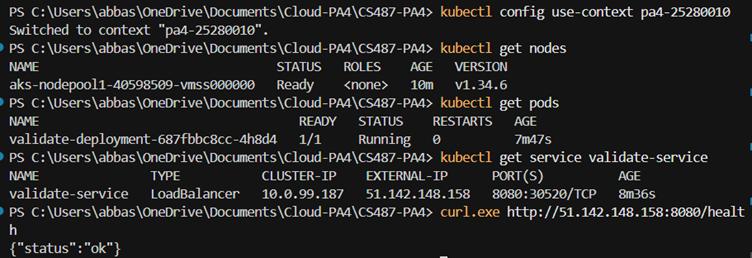

Description: Worker **nodes** are Ready and the **validate-api** pod(s) are **Running**, showing the validator workload is scheduled on the cluster.

### Evidence 5.3, 5.4, and 5.6 (no matching PNG files in `docs/`)

There are no separate screenshots for **`kubectl get service validate-service`** (LoadBalancer IP), combined **`curl /health`** / **`curl /validate`** runs, or **idle AKS** metrics; **5.2** (nodes/pods) provides cluster-side context.

### Evidence 5.5: Function App `VALIDATE_URL`

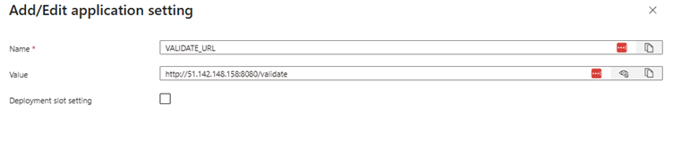

Description: **`VALIDATE_URL`** is set to the HTTP endpoint of the validator on AKS (load balancer URL + path); the **validate** activity POSTs order JSON to this URL.

---

## Task 6: ACI Report Job (15 points)

### Evidence 6.1: Blob Container

Description: The **`reports`** container holds generated PDFs written by the **report-job** ACI using the configured storage account.

### Evidence 6.2: Manual ACI Run

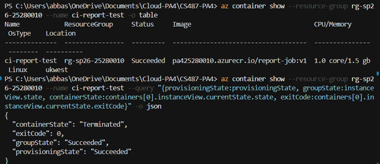

Description: **`az container show`** for **`ci-report-test`** shows the container group reached a terminal **Succeeded** state after the job finished; the task exits when PDF upload completes.

### Evidence 6.3: ACI Logs

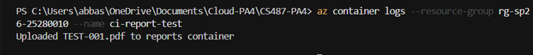

Description: Logs show the report container generating the PDF and uploading to Blob (paths/messages as emitted by `report-job`).

### Evidence 6.4: Generated PDF

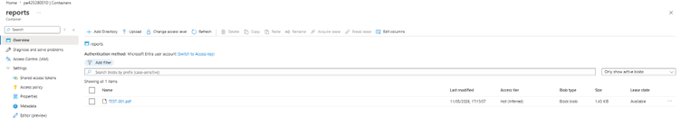

Description: The blob listing or file view proves **`TEST-001.pdf`** (or the run’s output name) landed in **`reports`**, confirming ACI wrote through to storage.

### Evidence 6.5: Function App Managed Identity and IAM

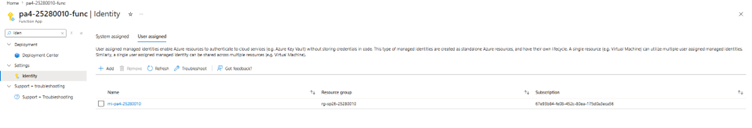

Description: The Function App uses **managed identity** so ARM can create/manage **ACI** without embedding secrets in code.

### Evidence 6.6: Report App Settings

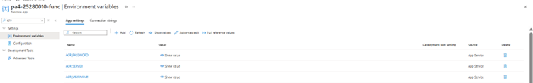

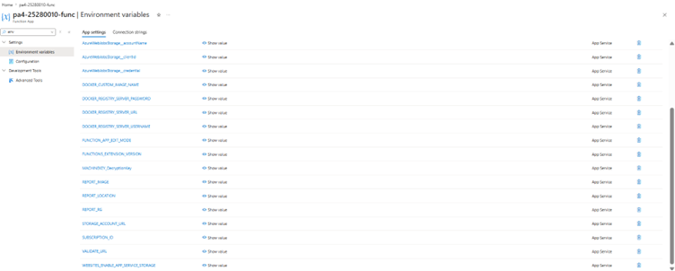

Description: **`REPORT_*`** selects CPU/memory/name/sku for ACI; **`ACR_*`** supplies registry login/server for image pull; **`STORAGE_CONN`** (or account/key split) targets the **`reports`** container; **`SUBSCRIPTION_ID`** scopes ACI creation to the lab subscription. Values that look like secrets should remain masked in screenshots.

---

## Task 7: End-to-End Pipeline (15 points)

### Evidence 7.1: Web App Wiring

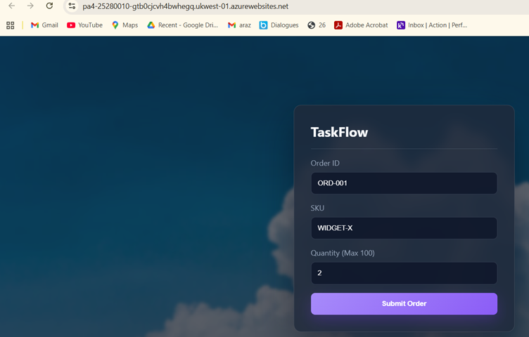

Description: **`FUNCTION_START_URL`** POSTs to the Durable HTTP starter; **`FUNCTION_STATUS_URL`** template lets the UI poll **`statusQueryGetUri`** until **Completed** / **Failed**.

### Evidence 7.2: Happy Path UI

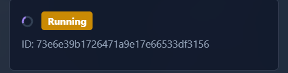

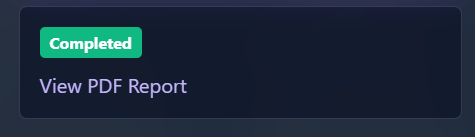

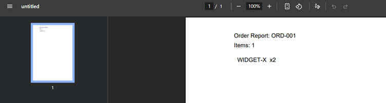

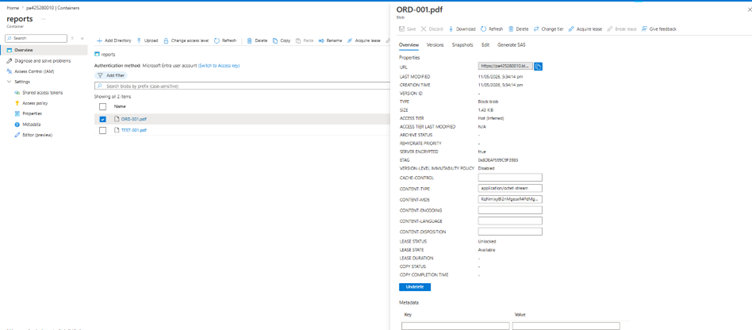

Description: Valid order fields (`product`, `qty` ≤ 100, etc.) show **Running** then **Completed** with a **report URL** pointing at the PDF in Blob-backed HTTP access.

### Evidence 7.3: Backend Participation

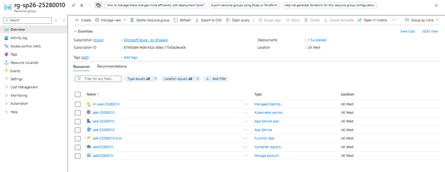

Description: The resource group groups **Function App**, **AKS**, **storage**, and related TaskFlow resources deployed for this PA.

### Evidence 7.4: Reject Path UI

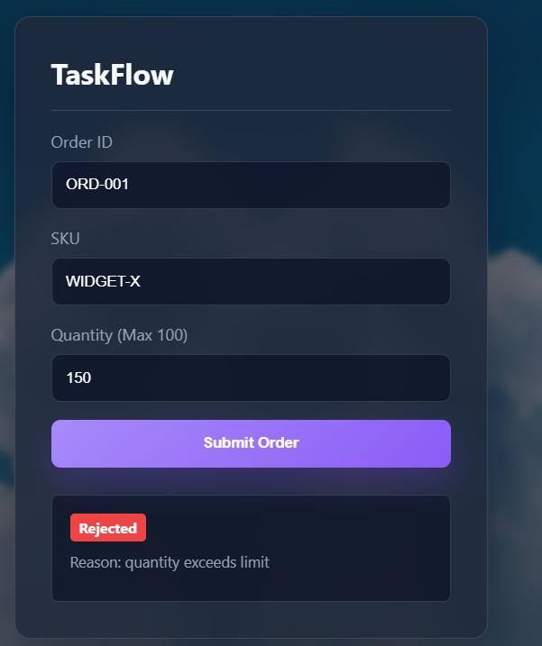

Description: Orders failing validation (**e.g. `qty > 100`**) surface **Failed** / rejected in the UI and **must not** enqueue a report ACI run for that path.

---

## Task 8: Write-up and Architecture Diagram (5 points)

### Evidence 8.1: Architecture Diagram

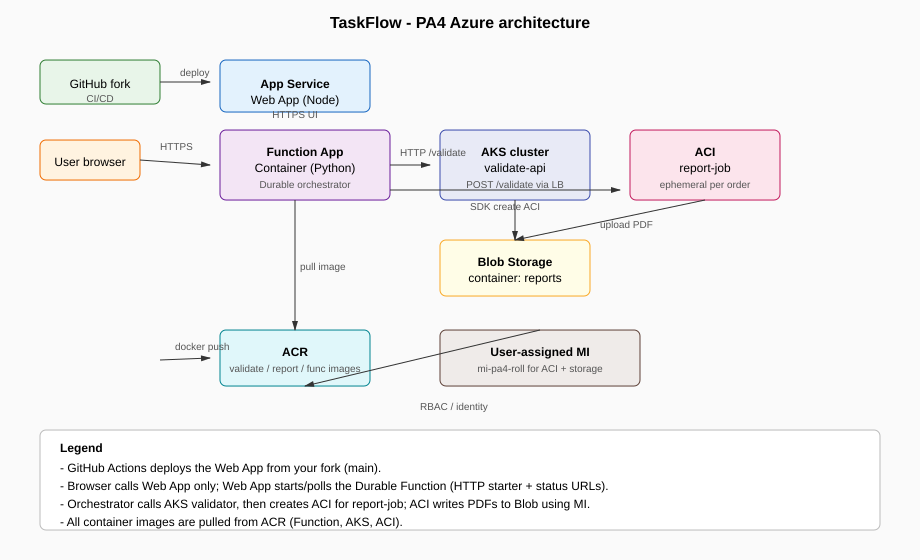

Description: The diagram shows **GitHub** (fork + CI/CD) deploying the **App Service** Web App; the **user browser** reaches the Web App over HTTPS. The Web App calls the **Function App** (containerized Python **Durable Functions** orchestrator). The orchestrator invokes **AKS** (`validate-api` behind a load balancer) for validation, then creates an **ACI** container group running `report-job` for PDF generation. **Blob Storage** (`reports` container) receives uploaded PDFs from ACI. **ACR** hosts images consumed by the Function App, AKS workloads, and ACI. A **user-assigned managed identity** is used for least-privilege access from ACI (and related automation) to storage and image pulls where configured—representing the IAM boundary called out in the assignment.

### Question 8.2: Service Selection

**App Service** hosts the TaskFlow HTTPS dashboard as a managed web runtime (Linux + Node). You avoid patching VMs or wiring reverse proxies yourself; deployment slots and GitHub Actions integration give a straightforward path from `main` to production with HTTPS certificates handled by the platform. For a small UI that mainly proxies orchestration calls to Durable Functions, App Service’s fixed SKU pricing and built-in scaling knobs match the “thin front end” role without running your own Kubernetes control plane for the web tier.

**Azure Functions (Durable)** implements the long-running “validate then generate report” workflow as code with automatic checkpointing and replay-safe orchestration steps. The assignment requires sequential stages with waits (HTTP activity to AKS, then provisioning ACI and polling completion); Durable Functions persists orchestration history so failures mid-flight do not force the user to resubmit from scratch. Using the Functions Premium or container hosting model also keeps dependencies consistent with the container images specified for this PA.

**AKS** runs the always-available **validate-api** service that must answer validation requests quickly and reliably. A Deployment behind a Service and load balancer gives rolling updates, health checks, and horizontal scaling if validation load grows; it fits a continuously listening HTTP API better than spinning a new cluster per request. Operational trade-off: you pay for the cluster’s agent nodes even when idle, which you contrast against ACI in Question 8.3.

**Azure Container Instances** runs the **report-job** as a short-lived, per-order batch container: pull image from ACR, render PDF, write to Blob, exit. You pay roughly for the duration of that container group instead of maintaining extra worker nodes 24/7, which matches bursty report generation. ACI’s simpler operational model (no kubelet, no node pool upgrades) is appropriate when each job is independent and needs no long-lived scheduling beyond “run once and finish.”

### Question 8.3: ACI vs AKS

**Idle behavior:** Our **AKS** cluster keeps **agent nodes** running even when no validation traffic arrives (unless scaled to zero via aggressive cluster autoscaler patterns not used in this minimal lab). **ACI** container groups for `report-job` exist only for the minutes they run; when no reports are requested, there is **no** standing ACI fleet billing compute the same way as idle worker VMs.

**Cost behavior:** In Cost Management scoped to our resource group, fixed recurring charges typically cluster around **AKS** (VM SKUs, OS disks, optional load balancer public IP) plus baseline App Service / Function hosting. **ACI** shows up as **spiky** line items tied to each successful validation path that triggered report generation—short bursts proportional to vCPU × RAM × duration. For **1000 rapid submits**, AKS cost scales with sustained CPU/network on the validation tier while ACI cost scales with **1000** container lifetimes (unless validation rejects early); spamming the UI stresses validation most; generating reports on every accept stresses ACI and Blob egress/write patterns.

**Operational model:** **AKS** requires Kubernetes manifests, Deployments, Services, upgrades, and RBAC integration with ACR and workload identity patterns—appropriate for a multi-replica API. **ACI** is “create container group, wait, delete”—minimal orchestration surface, ideal for **disposable** PDF workers where Kubernetes would be heavier than needed.

### Question 8.4: Durable Functions vs Plain HTTP

**Plain HTTP chains** (Web App calling Function A calling Function B with no durable orchestration) break down when **timeouts** occur: App Service and HTTP clients enforce finite request durations, but report generation via ACI can exceed those limits. Durable Functions lets the **client poll status** while the orchestration continues asynchronously, so you are not forced to keep a single HTTP request open for the entire ACI lifetime.

**Reliability and duplicate side effects:** If a plain chain retries after a partial success (network blip after validation but before report), you risk **double-charging** business operations or **duplicate ACI** runs without idempotency everywhere. Durable orchestrations record progress and use replay semantics so activities can be written to be **deterministic** with respect to orchestration decisions, reducing “at-least-once” HTTP retry explosions across three disparate Azure services.

### Question 8.5: Cost Review

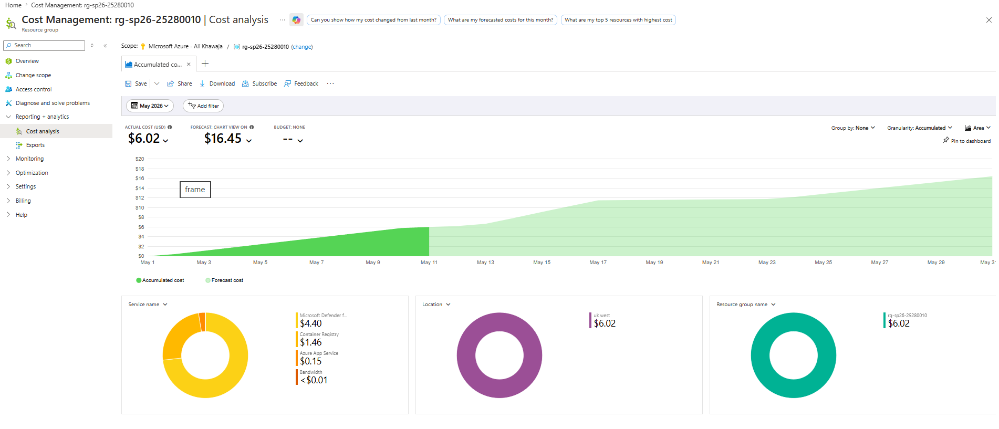

Description: Cost analysis is scoped to **this PA’s resource group** (see chart scope/filters in the screenshot). The largest share is typically **AKS** (always-on nodes and disks), then **App Service plan** / **Functions** hosting; **storage** and **ACI** appear as smaller or spiky lines depending on report traffic; **ACR** stays modest at lab scale.

### Question 8.6: Challenges Faced

**Regional quota / capacity:** Deploying AKS or related compute in a restricted region sometimes fails with **InsufficientQuota** or capacity errors. Debugging involved checking **az aks create** / portal error details, switching to an allowed region per course policy (for example **UK West**), or requesting a quota increase, then re-running deployment scripts after **az provider register** and subscription limits were confirmed.

**Integrating managed identity and storage settings:** The Function App and ACI paths must use consistent **identity** and **Blob** permissions (RBAC roles such as Storage Blob Data Contributor on the right scope). Misconfiguration surfaces as **403** from Blob or failed ACI pulls from ACR. Debugging combined **portal Diagnostics**, **Storage Account → Access Control**, `az role assignment list`, and verifying environment variables (`AzureWebJobsStorage__*` style settings vs connection strings) until uploads from `report-job` succeeded end-to-end.

---
